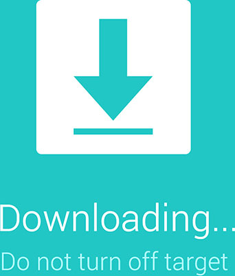

# Download Mode
{ width="192", align=right }

## What is it? Where is it used for?
Download Mode is a mode that can be used for installing a new operating system or software onto your device. 
 
It can also be used for restoring/reverting your device back to its original state. Like when your device doesnt start up properly anymore.
