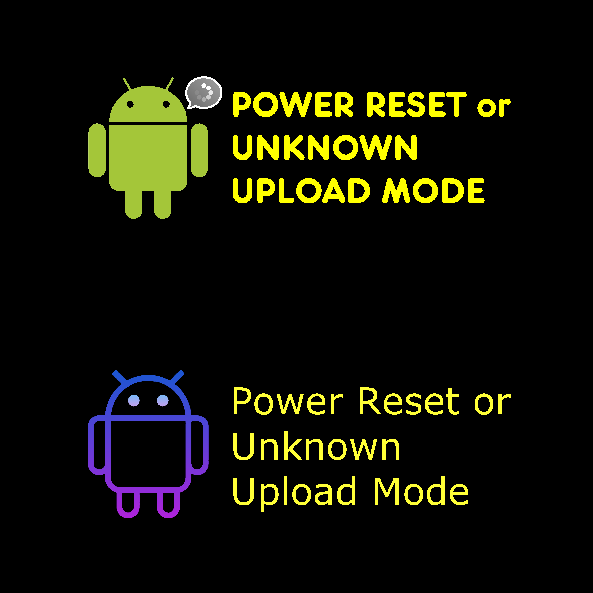
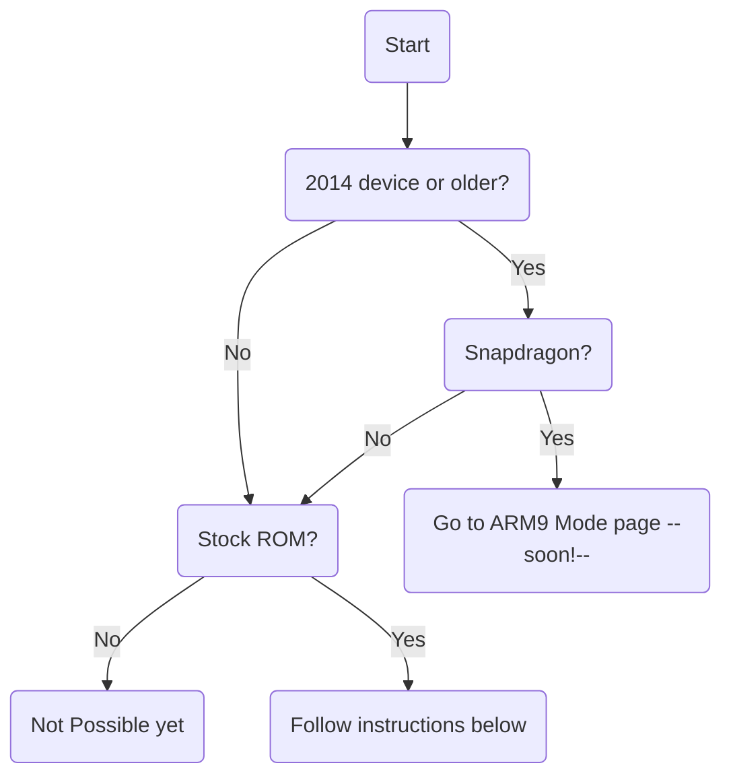

# Upload Mode
{ width="256", align=right }

## What is it? Where is it used for?
Upload mode is a mode we unfortunatly don't know too much about yet. However we do know it can be triggered by anything from a power reset to a crash of a certain thing on your device.
We also know it can be used for dumping RAM, which could contain useful info as to why the device crashed. When your device is in Upload Mode it still shows up on your PC as if it was in Download Mode.


## Determine whether your device can enter Upload Mode


## Enabling/Disabling Upload Mode
### Open sysdump menu
=== "For phones"

    Open Phone app and type ``*#9900#``

=== "For tablets"

     Make sure Samsung Calculator is installed.<br>
     Open the calculator app and type ``(+30012012732+`` after that type ``*#9900#``<br>

### Enable/Disable
**READ BEFORE FOLLOWING THESE STEPS**<br>
Check if there is an option that says "Upload Mode" (doesnt have to be exact)<br>
If there is, you can skip steps below and just tap on it to enable/disable it and then reboot your device.
=== "Enable"

    1. Scroll down and tap on the option that says "DEBUG LEVEL".
    2. Tap on **HIGH** or **HI**.
    3. Your device will reboot and Upload Mode is now **enabled**.

=== "Disable"

    1. Scroll down and tap on the option that says "DEBUG LEVEL".
    2. Tap on **LOW** or **LO**.
    3. Your device will reboot and Upload Mode is now **disabled**.

## How to enter Upload Mode
Before doing any of the steps here... Please take a look if your device can enter Upload Mode and if you have enabled it. Make sure your device is powered on.<br>
Preform a power reset by holding one of the following combos:<br>
**VOL -** & **Power**<br>
**VOL -** & **Home** & **Power**<br>
As soon as your screen goes black release the buttons.
You should now see Upload Mode on your screen.

## Dumping RAM using Upload Mode
**NOTE: The tool we are using currently doesnt properly work with Samsung devices using a Snapdragon or Spreadtrum SoC. Please make sure you are using an Exynos device.**<br>
We will be using the following tools: [SUC (Samsung Upload Client)](https://github.com/bkerler/sboot_dump)

=== "Linux"

    **Required packages**    
    - Debian/Ubuntu
    ```
    sudo apt-get install python3 python3-pip git
    ```
    - Arch
    ```
    sudo pacman -S python python-pip git
    ```
    **Install**
    ```
    sudo pip install pyusb pyserial
    git clone https://github.com/bkerler/sboot_dump
    cd sboot_dump
    ```
    **Usage**
    ```
    ./samupload.py all
    ```

=== "Windows"
    **To do**
    use program on windows VM and write instructions.